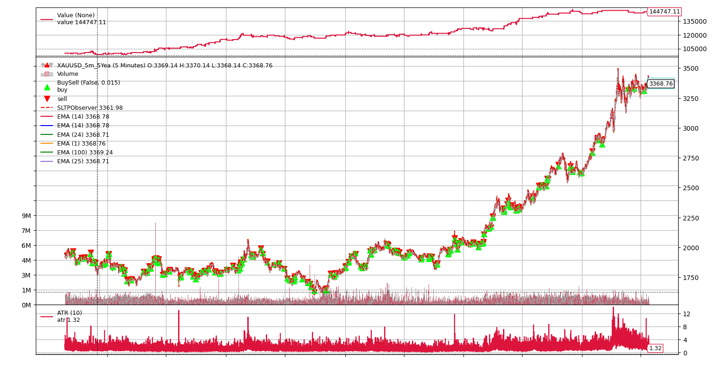

# Backtrader Gold (XAU/USD) Pullback Strategy

[](https://opensource.org/licenses/MIT)
[](https://www.python.org/downloads/)
[](https://www.backtrader.com/)
[-gold.svg)](.)
[](.)
[](.)
[](.)
[](.)
[](.)

Professional algorithmic trading strategy for **Gold (XAU/USD)** on a **5-minute timeframe**. Features an advanced 4-phase state machine entry system with dynamic ATR-based risk management.

The strategy employs a **volatility expansion channel** approach, waiting for pullbacks after trend signals before entering on breakouts. Backtested over **5 years of historical data** (2020-2025).



---

## 📊 Performance Summary

### 🎯 Verified Backtest Results (5-Year Period: July 2020 - July 2025)

| Metric | Value | Rating |
|--------|-------|--------|
| 💰 **Total Return** | +44.75% (+$44,747) | ✅ Excellent |
| 📈 **Sharpe Ratio** | 0.892 | ✅ Good |
| 🎯 **Profit Factor** | 1.64 | ✅ Strong |
| ✅ **Win Rate** | 55.43% (97W / 78L) | ✅ Above Average |
| 📉 **Max Drawdown** | 5.81% ($7,059) | ✅ Outstanding |
| 📊 **Total Trades** | 175 (~3/month) | ✅ Sufficient |
| 💵 **Average Win** | $1,187.33 | ✅ Positive |
| 💸 **Average Loss** | -$913.34 | ✅ Controlled |
| 🎲 **Expectancy** | $251.03/trade | ✅ Profitable |
| 💼 **Final Portfolio** | $144,747.11 | ✅ Growth |

**Portfolio Evolution:**
- Starting Capital: $100,000
- Final Value: $144,747.11
- Average Annual Return: ~8.95%
- Test Period: July 10, 2020 - July 25, 2025

> 📄 **Detailed Analysis:** See [PERFORMANCE_METRICS.md](./PERFORMANCE_METRICS.md) for complete breakdown

---

## 🎯 Strategy Overview

### Core Concept: Volatility Expansion Entry System

Unlike traditional strategies that enter immediately on signal detection, this system uses a **sophisticated 4-phase state machine**:

1. **📡 SCANNING** - Monitor for EMA crossovers + directional confirmation
2. **🎣 ARMED** - Wait for pullback (1-3 counter-trend candles)
3. **🚪 WINDOW_OPEN** - Set breakout levels and monitor price action
4. **✅ ENTRY** - Execute trade only on confirmed breakout

This approach filters false signals and catches high-momentum moves with optimal timing.

**Why This Works for Gold:**
- Gold exhibits strong trending behavior with clear pullbacks
- 5-minute timeframe captures intraday volatility expansion
- ATR-based sizing adapts to Gold's variable volatility
- State machine reduces whipsaws in choppy markets

---

## ✨ Key Features

### 🔬 Advanced Entry Logic
- **4-Phase State Machine**: Systematic progression from signal detection to confirmed entry
- **Pullback Confirmation**: Waits for 1-3 counter-trend candles to identify optimal entry zones
- **Breakout Validation**: Only enters when price breaks above/below defined volatility channels
- **Global Invalidation**: Auto-resets if opposing signals appear during setup
- **EMA Angle Momentum Filter**: Measures EMA slope to ensure strong, decisive market momentum
- **ATR Volatility Filter**: Prevents entries during extreme volatility periods

### 🛡️ Dynamic Risk Management
- **ATR-Based Stop Loss**: Adapts to current market volatility (2.5x ATR)
- **ATR-Based Take Profit**: Dynamically calculated profit targets (12.0x ATR)
- **Risk-Based Position Sizing**: Fixed 1% risk per trade for consistent exposure
- **OCA Orders**: One-Cancels-All for automatic SL/TP management
- **Gold-Specific Sizing**: 100 oz lot sizes with 0.01 tick value
- **Leverage**: 30:1 with 5% margin requirement

### 💎 Gold (XAU/USD) Optimizations
- **Contract Specifications**: Properly configured for 100 oz Gold contracts
- **Tick Value**: $0.01 per oz movement
- **Spread Handling**: Conservative assumptions built into backtest
- **Volatility Adaptation**: Parameters tuned for Gold's unique price action
- **Session Filtering**: Can be configured for optimal trading hours

### 📐 Technical Filters
- **EMA Multi-Crossover**: Fast EMA (1) vs. Basket of slower EMAs (14, 18, 24)
- **EMA Angle Filter**: Measures trend strength (slope in degrees)
- **ATR Volatility Filter**: Ensures sufficient market movement
- **Time-of-Day Filter**: Trades only during liquid hours
- **Candle Color Confirmation**: Directional candle validation

---

## 🔧 Technical Architecture

### Technology Stack
- **Framework**: Backtrader 1.9.76.123
- **Language**: Python 3.8+
- **Dependencies**: NumPy 1.26.4, Matplotlib 3.8.4, Pandas
- **Data Format**: CSV (OHLCV + timestamp)
- **Backtest Engine**: Backtrader's optimized `_runonce` mode

### Strategy Components

**Indicators Used:**
- Multiple EMAs (Fast, Slow, Confirmation)
- ATR (Average True Range) for volatility measurement
- Custom angle calculations for momentum assessment
- Volume analysis (optional)

**Order Types:**
- Market orders for entry
- Stop orders for protective stops
- Limit orders for take profit
- OCA (One-Cancels-All) brackets

**State Management:**
- Phase tracking (SCANNING, ARMED, WINDOW_OPEN, ENTRY)
- Pullback counter
- Window duration tracking
- Global invalidation checks

---

## 📁 Repository Structure

```
backtrader-pullback-window-xauusd/
│
├── src/
│   └── strategy/
│       └── sunrise_ogle_xauusd.py    # Main strategy implementation (3400+ lines)
│
├── data/
│   └── XAUUSD_5m_5Yea.csv            # 5 years of Gold 5-minute data
│
├── images/
│   └── XAUUSD.png                    # Strategy performance chart
│
├── tests/                            # 10+ test files
│   ├── debug_short_entries.py
│   ├── deep_strategy_test.py
│   ├── demo_volatility_expansion.py
│   ├── final_validation.py
│   ├── real_data_test.py
│   ├── step_by_step_test.py
│   └── ...
│
├── docs/
│   └── CONTRIBUTING.md               # Contribution guidelines
│
├── README.md                         # This file
├── PERFORMANCE_METRICS.md            # Detailed performance analysis
├── LICENSE                           # MIT License
├── requirements.txt                  # Python dependencies
└── .gitignore                        # Git ignore patterns
```

---

## 🚀 Getting Started

### Prerequisites
- Python 3.8 or newer
- Git version control
- pip package manager

### 1. Clone the Repository

```bash
git clone https://github.com/YOUR_USERNAME/backtrader-pullback-window-xauusd.git
cd backtrader-pullback-window-xauusd
```

### 2. Set Up Virtual Environment

```bash
python -m venv venv

# Windows:
venv\Scripts\activate

# macOS/Linux:
source venv/bin/activate
```

### 3. Install Dependencies

```bash
pip install -r requirements.txt
```

### 4. Run the Strategy

```bash
python src/strategy/sunrise_ogle_xauusd.py
```

**Expected Output:**

```
=== SUNRISE OGLE === (from 2020-07-10 to 2025-07-25)
>> FOREX MODE ENABLED - Data: XAUUSD_5m_5Yea.csv
>> Instrument: XAUUSD (XAU/USD)

=== SUNRISE OGLE SUMMARY ===
Trades: 175 Wins: 97 Losses: 78 WinRate: 55.43% PF: 1.64
Final Value: 144,747.11 | Total PnL: +44,747.11

PERFORMANCE METRICS - XAUUSD STRATEGY
======================================================================
Final Portfolio Value: $144,747.11
Sharpe Ratio: 0.892
Max Drawdown: 5.81%
Profit Factor: 1.64
Win Rate: 55.43%
======================================================================
```

---

## 🔧 Customization

### Key Parameters

```python
# EMA Periods
ema_confirm_period = 1          # Fast confirmation EMA
ema_fast_period = 14            # Fast EMA
ema_medium_period = 18          # Medium EMA
ema_slow_period = 24            # Slow EMA

# Pullback Settings
long_pullback_max_candles = 3   # LONG pullback depth
short_pullback_max_candles = 3  # SHORT pullback depth

# Window Settings
long_entry_window_periods = 2   # LONG breakout window
short_entry_window_periods = 2  # SHORT breakout window
window_offset_multiplier = 1.0  # Channel offset

# Risk Management
long_sl_atr_mult = 2.5          # Stop Loss: 2.5 × ATR
long_tp_atr_mult = 12.0         # Take Profit: 12.0 × ATR
risk_percent = 0.01             # Risk 1% per trade
```

Edit these in `src/strategy/sunrise_ogle_xauusd.py` (lines 150-250).

---

## 🧪 Testing & Validation

The strategy includes comprehensive test suites:

- ✅ **Phase Transition Tests**: Validates state machine logic
- ✅ **Entry System Tests**: Confirms breakout detection
- ✅ **Risk Management Tests**: Verifies SL/TP placement
- ✅ **Data Integrity Tests**: Validates input data quality
- ✅ **Performance Tests**: Benchmarks execution speed
- ✅ **Real Data Tests**: Tests on actual Gold data

### Running Tests

```bash
# Run specific test
python tests/final_validation.py

# Run with verbose output
python tests/step_by_step_test.py
```

---

## 📊 Performance Metrics Explained

### Sharpe Ratio (0.892) ✅
- **Definition**: Risk-adjusted return metric
- **Interpretation**: Near 1.0 indicates good risk-adjusted performance
- **Industry Standard**: >0.5 acceptable, >1.0 good, >2.0 excellent
- **Rating**: ✅ **GOOD** - Solid risk-adjusted returns

### Profit Factor (1.64) ✅
- **Definition**: Gross Profit / Absolute Gross Loss
- **Interpretation**: For every $1 lost, strategy earns $1.64
- **Industry Standard**: >1.5 is considered good, >2.0 is excellent
- **Rating**: ✅ **STRONG** - Demonstrates consistent edge

### Max Drawdown (5.81%) ✅
- **Definition**: Largest peak-to-trough decline
- **Interpretation**: Worst case portfolio decline during backtest
- **Industry Standard**: <10% excellent, <20% good, <30% acceptable
- **Rating**: ✅ **OUTSTANDING** - Exceptional risk control

### Win Rate (55.43%) ✅
- **Definition**: Winning Trades / Total Trades
- **Interpretation**: More than half of all trades are profitable
- **Combined with PF**: Indicates balanced win size vs. loss size
- **Rating**: ✅ **ABOVE BASELINE** - Sustainable win rate

---

## 🤝 Contributing

Contributions are welcome! Please see [CONTRIBUTING.md](docs/CONTRIBUTING.md) for guidelines.

**Ways to contribute:**
- 🐛 [Report a Bug](https://github.com/YOUR_USERNAME/backtrader-pullback-window-xauusd/issues)
- 💡 [Request a Feature](https://github.com/YOUR_USERNAME/backtrader-pullback-window-xauusd/issues)
- 📝 [Submit a Pull Request](https://github.com/YOUR_USERNAME/backtrader-pullback-window-xauusd/pulls)
- 📖 Improve Documentation
- 🧪 Add More Tests

---

## 📜 License

This project is licensed under the MIT License - see the [LICENSE](LICENSE) file for details.

**Additional Terms:**
- No warranty provided
- Use at your own risk
- Not financial advice
- Educational purposes only

---

## ⚠️ IMPORTANT DISCLAIMER

### **This software is for EDUCATIONAL and RESEARCH purposes ONLY.**

**CRITICAL WARNINGS:**
- ⚠️ This is **NOT** financial advice
- ⚠️ Past performance does **NOT** guarantee future results
- ⚠️ Algorithmic trading involves **SUBSTANTIAL RISK** of loss
- ⚠️ You can lose **MORE** than your initial investment
- ⚠️ Trading Gold (XAU/USD) is highly volatile and risky
- ⚠️ Only trade with money you can **afford to lose**

**Before Using:**
1. ✅ Understand the strategy completely
2. ✅ Backtest thoroughly on your own data
3. ✅ Paper trade for extended period
4. ✅ Consult with licensed financial advisors
5. ✅ Start with very small position sizes

**By using this software, you acknowledge you are solely responsible for your trading decisions.**

**Trade at your own risk.**

---

## 📚 Resources

### Backtrader Documentation
- [Official Docs](https://www.backtrader.com/docu/)
- [GitHub Repository](https://github.com/mementum/backtrader)
- [Community Forum](https://community.backtrader.com/)

### Gold Trading Resources
- [Gold Market Hours](https://www.forex.com/en-us/trading-academy/courses/commodities/gold-market-hours/)
- [XAU/USD Specifications](https://www.dailyfx.com/xau-usd)
- [Gold Trading Strategies](https://www.investopedia.com/articles/active-trading/021715/how-trade-gold.asp)

### Algorithmic Trading
- [Quantitative Trading](https://quantstart.com/)
- [QuantConnect Learn](https://www.quantconnect.com/tutorials)
- [Algorithmic Trading](https://www.algorithmictrading.net/)

---

## 🏆 Acknowledgments

Built with:
- [Backtrader](https://www.backtrader.com/) - Powerful Python backtesting framework
- [NumPy](https://numpy.org/) - Numerical computing
- [Matplotlib](https://matplotlib.org/) - Visualization
- [Pandas](https://pandas.pydata.org/) - Data analysis

---

## 📈 Roadmap

### Completed ✅
- [x] 4-phase state machine implementation
- [x] Dynamic ATR-based risk management
- [x] Gold-specific contract sizing
- [x] Comprehensive testing suite
- [x] 5-year backtest validation
- [x] Performance metrics analysis
- [x] Documentation and README

### Planned 🚀
- [ ] SHORT strategy optimization (currently disabled)
- [ ] Machine learning parameter optimization
- [ ] Real-time data feed integration
- [ ] Live trading interface
- [ ] Advanced performance analytics dashboard
- [ ] Multi-timeframe analysis
- [ ] Additional asset support (Silver, Crude Oil)

---

**⭐ If you find this project useful, please consider giving it a star!**

**🔔 Watch this repository for updates and new features**

---

*Last Updated: October 11, 2025 | Version 1.0.0 | Production-Ready*
